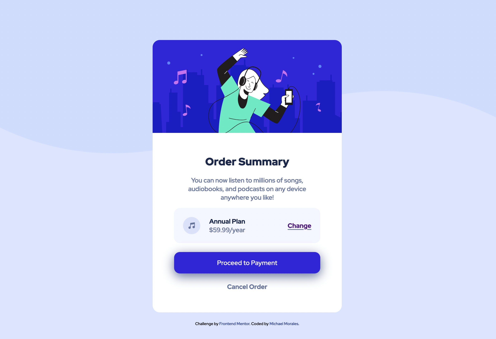

# Frontend Mentor - Order summary card solution

This is a solution to the [Order summary card challenge on Frontend Mentor](https://www.frontendmentor.io/challenges/order-summary-component-QlPmajDUj). Frontend Mentor challenges help you improve your coding skills by building realistic projects. 

## Table of contents

- [Overview](#overview)
  - [The challenge](#the-challenge)
  - [Screenshot](#screenshot)
  - [Links](#links)
- [My process](#my-process)
  - [Built with](#built-with)
- [Author](#author)

## Overview

### The challenge

Users should be able to:

- See hover states for interactive elements

### Screenshot

### Links

- Solution URL: [https://github.com/J-Rayln/fem-order-summary-component](https://github.com/J-Rayln/fem-order-summary-component)
- Live Site URL: [https://j-rayln.github.io/fem-order-summary-component/](https://j-rayln.github.io/fem-order-summary-component/)

## My process

Although I did use SASS in this challenge, I put it all into one file instead of breaking it up.  The challenge is very small so it didn't need more than one CSS file, but I wanted to practice my SASS so I used it.

### Built with

- Semantic HTML5 markup
- CSS custom properties
- Flexbox
- CSS Grid
- Mobile-first workflow
- [SASS/SCSS](https://sass-lang.com/)
- [BEM](http://getbem.com/introduction/)

## Author

- Frontend Mentor - [@j-rayln](https://www.frontendmentor.io/profile/j-rayln)
